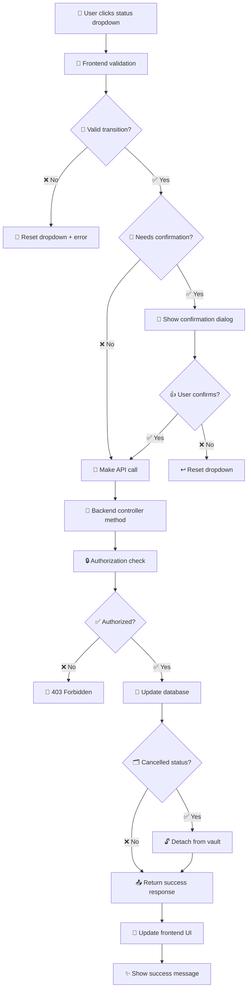

# 🐷 Piggy Bank Status Update Flow Documentation

## 🎯 Overview

The piggy bank status update system handles transitions between different states (`active`, `paused`, `done`, `cancelled`) with automatic vault detachment for cancelled piggy banks. The flow involves frontend validation, backend processing, and UI updates.

## 📊 Status States

| Status | Icon | Description | Can Transition To |
|--------|------|-------------|-------------------|
| `active` | 🟢 | Currently saving money | `paused`, `done`, `cancelled` |
| `paused` | ⏸️ | Temporarily stopped | `active`, `done`, `cancelled` |
| `done` | ✅ | Goal completed | _(final state)_ |
| `cancelled` | ❌ | Goal abandoned | _(final state)_ |

## 🔄 Flow Architecture



## 📁 File Structure

### Frontend Files
- **`resources/views/piggy-banks/show.blade.php`** - Contains the status dropdown UI
- **`public/js/scheduled-savings.js`** - Main status change logic
- **`public/js/utils.js`** - Helper functions for API calls

### Backend Files
- **`routes/web.php`** - Defines localized routes for status changes
- **`config/route-slugs.php`** - Route translations for different languages
- **`app/Http/Controllers/PiggyBankController.php`** - Handles status update requests
- **`app/Models/PiggyBank.php`** - Contains status constants and relationships
- **`app/Policies/PiggyBankPolicy.php`** - Authorization rules

## 🎨 Frontend Implementation

### 1. Status Dropdown UI
**File:** `resources/views/piggy-banks/show.blade.php`

```html
<select id="piggy-bank-status-{{ $piggyBank->id }}"
        data-initial-status="{{ $piggyBank->status }}">
    @foreach(\App\Models\PiggyBank::getStatusOptions() as $statusOption)
        <option value="{{ $statusOption }}">{{ __(strtolower($statusOption)) }}</option>
    @endforeach
</select>
```

### 2. Event Handling
**File:** `public/js/scheduled-savings.js`

**Function:** `addEventListener('change')`
- 🎯 **Purpose:** Listens for dropdown changes
- 🔍 **Validation:** Checks if transition is allowed via `STATUS_TRANSITIONS`
- 🚨 **Confirmation:** Shows dialog for destructive actions (PWUC = "Proceed With User Confirmation")

### 3. API Call Function
**File:** `public/js/scheduled-savings.js`

**Function:** `updatePiggyBankStatus(piggyBankId, endpoint, newStatus, method)`
- 📡 **Makes:** PATCH request to backend
- 📝 **Sends:** `{ status: newStatus }` in JSON body
- 🔄 **Updates:** UI elements on success

## 🛠️ Backend Implementation

### 1. Route Configuration
**File:** `routes/web.php`

```php
// Localized routes for each status change
Route::patch('{piggy_id}/pause', [PiggyBankController::class, 'pause'])
    ->name('piggy-banks.pause');
Route::patch('{piggy_id}/resume', [PiggyBankController::class, 'resume'])
    ->name('piggy-banks.resume');
Route::patch('{piggy_id}/update-status-cancelled', [PiggyBankController::class, 'updateStatusToCancelled'])
    ->name('piggy-banks.update-status-cancelled');
```

### 2. Controller Methods
**File:** `app/Http/Controllers/PiggyBankController.php`

#### 🚫 Cancel Status Method
**Method:** `updateStatusToCancelled($piggy_id)`

```php
public function updateStatusToCancelled($piggy_id)
{
    $piggyBank = PiggyBank::findOrFail($piggy_id);
    
    // 🔒 Authorization check
    if (!Gate::allows('update', $piggyBank)) {
        abort(403);
    }
    
    // ✅ Business logic validation
    if (in_array($piggyBank->status, ['done', 'cancelled'])) {
        return response()->json(['error' => 'Cannot cancel...'], 400);
    }
    
    // 💾 Update database + 🗂️ Detach from vault
    $piggyBank->update([
        'status' => 'cancelled',
        'vault_id' => null,  // 🔓 Auto-detachment
    ]);
    
    return response()->json([
        'status' => 'cancelled',
        'message' => __('Piggy bank has been cancelled.'),
    ]);
}
```

## 🌍 Localization System

### Route Translations
**File:** `config/route-slugs.php`

```php
'piggy-banks' => [
    'en' => 'piggy-banks',
    'tr' => 'kumbaralarim',
    'fr' => 'mes-tirelires',
],
```

### Dynamic Route Building
**File:** `public/js/scheduled-savings.js`

```javascript
// 🏗️ Builds localized route URLs
const localizedRouteName = `${transition.endpoint}.${locale}`;
const endpoint = buildRouteUrl(localizedRouteName, {
    locale: locale,
    piggy_id: piggyBankId
});
```

## 🔐 Security & Authorization

### Gate Policy Check
**File:** `app/Policies/PiggyBankPolicy.php`

```php
public function update(User $user, PiggyBank $piggyBank): bool
{
    return $user->id === $piggyBank->user_id;
}
```

### CSRF Protection
- 🛡️ **Token:** Included in all AJAX requests via meta tag
- 🔒 **Validation:** Automatically handled by Laravel middleware

## 🚨 Error Handling

### Frontend Error Handling
```javascript
try {
    const result = await updatePiggyBankStatus(/*...*/);
    // ✅ Success handling
} catch (error) {
    console.error('Transition error:', error);
    selectElement.value = currentStatus; // ↩️ Reset dropdown
    showFlashMessage('Failed to update...', 'error');
}
```

### Backend Error Responses
```php
// 🚫 Business logic errors
return response()->json(['error' => 'Cannot cancel...'], 400);

// 🔒 Authorization errors
abort(403);

// 🔍 Not found errors
$piggyBank = PiggyBank::findOrFail($piggy_id); // Auto 404
```

## 🔗 Vault Integration

### Automatic Vault Detachment
When a piggy bank is cancelled:

1. **Database Update:** `vault_id` set to `null`
2. **Vault Recalculation:** Total automatically updates (excludes cancelled piggy banks)
3. **No Manual Cleanup:** Vault totals stay accurate without additional code

```php
// 🎯 This line does the magic
$piggyBank->update([
    'status' => 'cancelled',
    'vault_id' => null,  // 🔓 Instant vault detachment
]);
```

## 🧪 Testing Status Changes

### Manual Testing Checklist
- [ ] 🟢 Active → Paused (should work)
- [ ] 🟢 Active → Done (should work)
- [ ] 🟢 Active → Cancelled (should work + detach from vault)
- [ ] ⏸️ Paused → Active (should work)
- [ ] ⏸️ Paused → Done (should work)
- [ ] ⏸️ Paused → Cancelled (should work + detach from vault)
- [ ] ❌ Done → Any (should be blocked)
- [ ] ❌ Cancelled → Any (should be blocked)

### Expected Behaviors
- 🔄 **UI Updates:** Dropdown reflects new status
- 🔒 **Disabled States:** Done/cancelled piggy banks can't change status
- 💰 **Money Actions:** Disabled for non-active piggy banks
- 📅 **Schedule Updates:** Automatically refreshed after status change
- 🗂️ **Vault Totals:** Automatically recalculated when piggy banks detached

## 🐛 Common Issues & Solutions

### Issue: Route Not Found
**Error:** `Route "piggy-banks.pause.en" not found`
**Solution:** Check `route-slugs.php` and ensure localized routes are properly registered

### Issue: Status Not Updating
**Error:** Dropdown resets to original value
**Solution:** Check browser console for JavaScript errors and network tab for failed requests

### Issue: Authorization Errors
**Error:** 403 Forbidden
**Solution:** Verify user owns the piggy bank and policies are correctly implemented

### Issue: Vault Total Not Updating
**Error:** Cancelled piggy bank still counted in vault
**Solution:** Ensure `vault_id` is set to `null` in the cancellation method

---

🎉 **Happy Status Changing!** This system ensures smooth transitions while maintaining data integrity and user experience.
